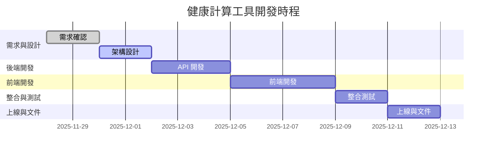

# Gantt Chart

```mermaid
gantt
    title 健康計算工具開發時程
    dateFormat  YYYY-MM-DD
    section 需求與設計
    需求確認           :done,    a1, 2025-11-28, 2d
    架構設計           :active,  a2, 2025-11-30, 2d
    section 後端開發
    API 開發           :         a3, 2025-12-02, 3d
    section 前端開發
    前端開發           :         a4, 2025-12-05, 4d
    section 整合與測試
    整合測試           :         a5, 2025-12-09, 2d
    section 上線與文件
    上線與文件         :         a6, 2025-12-11, 2d
```
